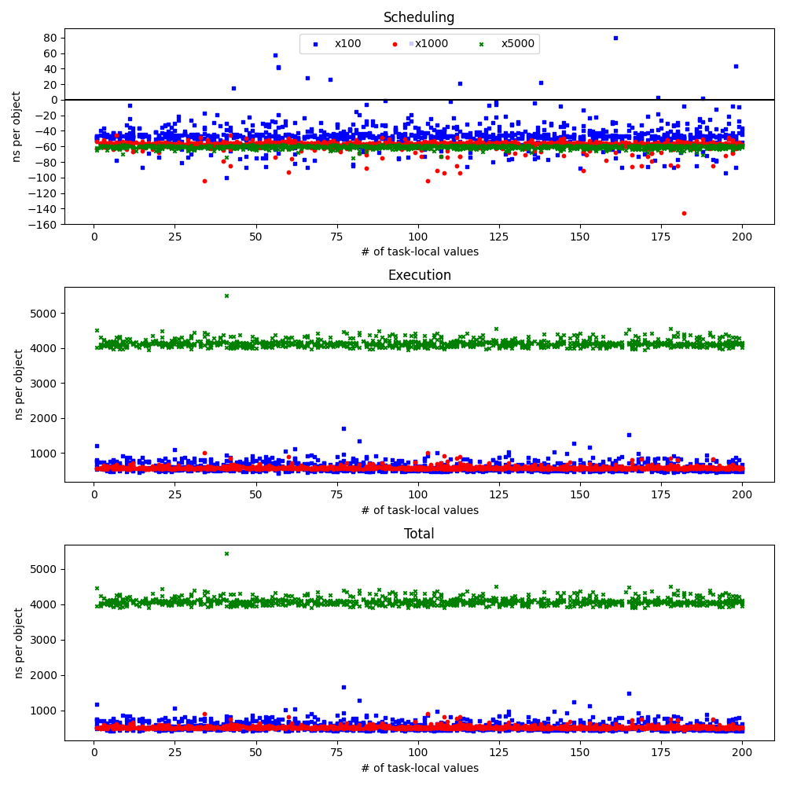

# deinit-benchmark

## Summary

Performance cost of async deinit vs regular deinit is linear (about 500-700ns per object) for small number of objects, but after certain threshold (about 2K queued objects) starts to grow quadratically. I don't have a good explanation for this.

After replacing std::set<> with llvm::DesnseSet<> in TaskLocal::copyTo(), the cost of copying task-locals values when scheduling async deinit is now 35ns per value. Before that it was `O(n*log(n))` with numbers of about 50ns/value for 10 values, and 80ns/item for 1000 values.

Fast path of the isolated deinit has additional cost of about 20ns per object when (not) copying task-local values, and 30-35ns when (not) resetting task-local values. Benchmark deallocates large tree of objects isolated on the same actor. Only the root objects hops (slow path), the rest are released already on the correct actor (fast path). In copying scenario fast path does not touch task-locals at all, so it is faster. In the resetting scenario fast path does not insert a barrier node because task-locals are already empty after the hop, but checking if task-locals are empty apparently costs additional 10-15ns.

Slow path of the isolated deinit with reseting task-local values costs about 130ns


## Experiments

### Async dinit

First let's validate that performance of async deinit without copying task-local values does not depend on the number of task-local values

```shell
$ ./run-benchmark.sh async_tree --values=1:200 --objects=100:100 --points=1000 > data/async_tree-vs-values-100.txt 
$ ./run-benchmark.sh async_tree --values=1:200 --objects=1000:1000 --points=1000 > data/async_tree-vs-values-1000.txt
$ ./run-benchmark.sh async_tree --values=1:200 --objects=5000:5000 --points=1000 > data/async_tree-vs-values-5000.txt
```

Plotting results shows pretty much horizontal lines, and attempting to perform regression against number of task-local values gives rubbish R².



```shell
$ ./regression.py data/async_tree-vs-values-100.txt -p v,1 
Scheduling:  0.0868072220715604⋅v + -4607.002487188412, R² = 0.0000, Adjusted R² = 0.0000
Execution :   -31.694233799276898⋅v + 64710.5348863039, R² = 0.0184, Adjusted R² = 0.0184
Total     : -31.607426577205334⋅v + 60103.532399115524, R² = 0.0193, Adjusted R² = 0.0193
$ ./regression.py data/async_tree-vs-values-1000.txt -p v,1
Scheduling:   -5.465219253223839⋅v + -57727.04201368913, R² = 0.0027, Adjusted R² = 0.0027
Execution :     5.433015934353694⋅v + 581079.9706013381, R² = 0.0000, Adjusted R² = 0.0000
Total     : -0.03220331886900761⋅v + 523352.92858764896, R² = 0.0000, Adjusted R² = 0.0000
$ ./regression.py data/async_tree-vs-values-5000.txt -p v,1
Scheduling: -6.053116772639871⋅v + -303492.6510272927, R² = 0.0014, Adjusted R² = 0.0014
Execution :  -40.5546100771584⋅v + 20718864.977466233, R² = 0.0000, Adjusted R² = 0.0000
Total     : -46.60772684979646⋅v + 20415372.326438945, R² = 0.0000, Adjusted R² = 0.0000
```

Now we can analyze performance of async deinit dependin only on number of objects.
