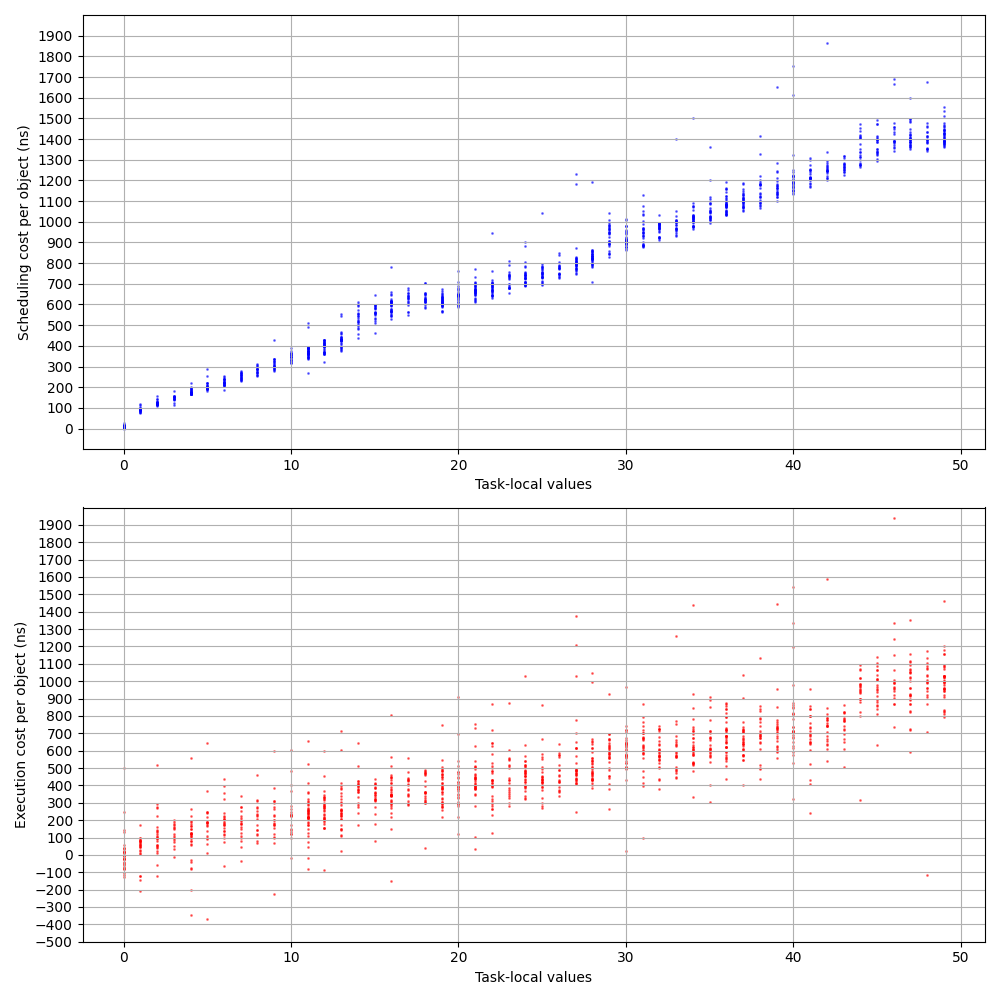

# deinit-benchmark

## Summary

Performance cost of async deinit vs regular deinit is linear (about 500-700ns per object) for small number of objects, but after certain threshold (about 2K queued objects) starts to grow quadratically. I don't have a good explanation for this.

After replacing std::set<> with llvm::DesnseSet<> in TaskLocal::copyTo(), the cost of copying task-locals values when scheduling async deinit is now 35ns per value. Before that it was `O(n*log(n))` with numbers of about 50ns/value for 10 values, and 80ns/item for 1000 values.

Fast path of the isolated deinit has additional cost of about 20ns per object when (not) copying task-local values, and 30-35ns when (not) resetting task-local values. Benchmark deallocates large tree of objects isolated on the same actor. Only the root objects hops (slow path), the rest are released already on the correct actor (fast path). In copying scenario fast path does not touch task-locals at all, so it is faster. In the resetting scenario fast path does not insert a barrier node because task-locals are already empty after the hop, but checking if task-locals are empty apparently costs additional 10-15ns.

Slow path of the isolated deinit with resetting task-local values costs about 140ns

## Experiments

### Setup

#### [deinit-benchmark.swift](./deinit-benchmark.swift)

Source code of the benchmark driver.

#### [run-benchmark.sh](./run-benchmark.sh)

Wrapper script which compiles, codesigns, and runs benchmark driver with appropriate runtime libraries.

```shell
$ ./run-benchmark.sh --help
Usage: deinit-benchmark BENCHMARK_NAME INPUTS_FILE [--ballast=N]
```

Benchmark driver measures specified benchmark for numbers of task-local values and objects given in `INPUTS_FILE`.
Using shared inputs allows results of different runs to be comparable between each other.

Two times are being reported:

* **Scheduling** - how long was the thread initiating destruction blocked.
* **Total** - time from initiating destruction, to the completion of the deinit body of the last object.

Benchmark driver outputs results to stdout, with a header recording parameters and showing column names:

```
# isolated_hop_copy_tree data/inputs-5K.txt --ballast=0
#
# schedule(ns) total(ns)
6584	8269500
5750	13276667
6000	4129208
...
```

For benchmarks where no hopping occurs, these two times should be almost identical.

Benchmarks come in array and tree variants. Array variants allow to cleanly measure costs of scheduling, while tree variants attempt to better mimic real-world scenarios.

All benchmarks use a single strong reference as a task-local value.

#### [gen-points.py](./gen-points.py)

This utility script can be used to generate inputs of desired configuration:
```shell
$ ./gen-points.py --help
usage: gen-points.py [-h] [-v MIN:MAX] [-o MIN:MAX] points

positional arguments:
  points

options:
  -h, --help            show this help message and exit
  -v MIN:MAX, --values MIN:MAX
                        Range of number of task-local values (default: 0:200)
  -o MIN:MAX, --objects MIN:MAX
                        Range of number of objects (default: 1:5000)

$ ./gen-points.py 1000 > data/inputs-1K.txt
$ ./gen-points.py 5000 > data/inputs-5K.txt 
```

Ranges are interpreted as closed intervals. It is possible to specify `MIN`=`MAX` to pin parameter to a specific value.
Otherwise values are generated randomly with linear distribution.

#### [regression.py](./regression.py)

Script for analyzing benchmark results by attempting to perform multi-variable linear regression:

```shell
$ ./regression.py --help
usage: regression.py [-h] [-d BASELINE] [-p PARAMS] [-y PHASES] [--min-values MIN_VALUES] [--max-values MAX_VALUES] [--min-objects MIN_OBJECTS] [--max-objects MAX_OBJECTS]
                     inputs dataset

positional arguments:
  inputs
  dataset

options:
  -h, --help            show this help message and exit
  -d BASELINE, --diff BASELINE
                        Apply regression to difference between dataset and baseline (default: None)
  -p PARAMS, --params PARAMS
                        Parameters for fit against. Comma-separated list of vo2,vo,v,o2,o,1 (default: vo,v,o,1)
  -y PHASES, --phases PHASES
                        Values for fit against. Comma-separated list of S,T - Scheduling, Total (default: S,T)
  --min-values MIN_VALUES
  --max-values MAX_VALUES
  --min-objects MIN_OBJECTS
  --max-objects MAX_OBJECTS
```

By default it attempts to fit the data against all possible parameters, and may produce overfitting models.
It is often helpful to manually limit parameters. E.g. `./regression.py dataset -p vo` will perform linear regression assuming costs are proportional to number of task-local **v**alues times number of **o**bjects.

Additionally it is possible to filter phases being analyzed. `./regression.py dataset -y T -p vo` will show only results for the **Total** phase.

To isolate incremental cost of new features, it is possible to perform regression against difference of two datasets. Baseline dataset can be specified using `--diff` parameter.

### Isolated deinit

#### 0. Baseline

```shell
$ ./run-benchmark.sh data/inputs-5K.txt nonisolated_array > data/nonisolated_array-5K.txt
$ ./run-benchmark.sh data/inputs-5K.txt nonisolated_tree > data/nonisolated_tree-5K.txt
$ ./regression.py data/inputs-5K.txt data/nonisolated_array-5K.txt -p o -y T
Total: 64⋅o, R² = 0.9950, Adjusted R² = 0.9950
$ ./regression.py data/inputs-5K.txt data/nonisolated_tree-5K.txt -p o -y T
Total: 63⋅o, R² = 0.6515, Adjusted R² = 0.6515
```

Deinitializing objects with regular deinit costs about 64ns. Of course, this varies depending on the stored properties and body of the `deinit`,
but this number is useful as a baseline for other benchmarks, which all have the same stored properties and `deinit` body.

#### 1. Fast path - copy

```shell
$ ./run-benchmark.sh data/inputs-5K.txt isolated_no_hop_copy_array > data/isolated_no_hop_copy_array-5K.txt
$ ./run-benchmark.sh data/inputs-5K.txt isolated_no_hop_copy_tree > data/isolated_no_hop_copy_tree-5K.txt
```

When copying (not resetting) task-local values, performance of the fast path of the isolated deinit does not depend on number of task-local values,
and costs about 16ns per object for array case and 18ns per object for tree case. Despite low R² for tree case, results are reproducible. The origin of the 2ns difference is not clear.

```shell
$ ./regression.py data/inputs-5K.txt data/isolated_no_hop_copy_array-5K.txt --diff data/nonisolated_array-5K.txt -p o -y T
Total: 16⋅o, R² = 0.8352, Adjusted R² = 0.8351
$ ./regression.py data/inputs-5K.txt data/isolated_no_hop_copy_tree-5K.txt --diff data/nonisolated_tree-5K.txt -p o -y T
Total: 18⋅o, R² = 0.1261, Adjusted R² = 0.1260
```

#### 2. Fast path - reset

```shell
$ ./run-benchmark.sh data/inputs-5K.txt isolated_no_hop_reset_array > data/isolated_no_hop_reset_array-5K.txt
$ ./run-benchmark.sh data/inputs-5K.txt isolated_no_hop_reset_tree > data/isolated_no_hop_reset_tree-5K.txt
```

When resetting task-local values, performance of the fast path of the isolated deinit also does not depend on number of task-local values, but costs per object are higher - 36ns for array case and 41ns for tree case. The 5ns difference between cases is reproducible, but its origin is not clear.

Extra work needed to reset task-local values is about 20ns per object.

```shell
$ ./regression.py data/inputs-5K.txt data/isolated_no_hop_reset_array-5K.txt --diff data/nonisolated_array-5K.txt -p o -y T
Total: 36⋅o, R² = 0.9446, Adjusted R² = 0.9446
$ ./regression.py data/inputs-5K.txt data/isolated_no_hop_reset_tree-5K.txt --diff data/nonisolated_tree-5K.txt -p o -y T
Total: 41⋅o, R² = 0.4243, Adjusted R² = 0.4242
```

#### 3. Slow path - reset

#### 3.1. Array

```shell
$ ./run-benchmark.sh data/inputs-5K.txt isolated_hop_reset_array > data/isolated_hop_reset_array-5K.txt
```

To interpret benchmark results we need to understand interaction between enqueueing and dequeueing tasks:

```shell
$ ./regression.py data/inputs-5K.txt data/isolated_hop_reset_array-5K.txt -p o   
Scheduling: 117⋅o, R² = 0.5794, Adjusted R² = 0.5793
Total     : 195⋅o, R² = 0.7279, Adjusted R² = 0.7278
```

Since total execution time is significantly larger then scheduling time, we can assume that draining the actor queue is happening slower then enqueueing.
Most of the time, actor queue is non-empty, and enqueueing and draining happens in parallel. Draining thread is not waiting for the enqueueing thread.

Measurements are quite noisy. Repeated benchmarks give slightly different values. Let's take enqueueing cost to be about 115ns.
```shell
$ ./regression.py data/inputs-5K.txt data/isolated_hop_reset_array-5K-2.txt -y S -p o
Scheduling: 108⋅o, R² = 0.6572, Adjusted R² = 0.6572
$ ./regression.py data/inputs-5K.txt data/isolated_hop_reset_array-5K-3.txt -y S -p o
Scheduling: 123⋅o, R² = 0.6173, Adjusted R² = 0.6172
$ ./regression.py data/inputs-5K.txt data/isolated_hop_reset_array-5K-4.txt -y S -p o
Scheduling: 124⋅o, R² = 0.5400, Adjusted R² = 0.5399
$ ./regression.py data/inputs-5K.txt data/isolated_hop_reset_array-5K-5.txt -y S -p o
Scheduling: 107⋅o, R² = 0.5702, Adjusted R² = 0.5702
```

And let's take additional cost of the dequeueing is about 140ns.

```shell
$ ./regression.py data/inputs-5K.txt data/isolated_hop_reset_array-5K.txt --diff data/nonisolated_array-5K.txt -y T -p o 
Total: 130⋅o, R² = 0.5423, Adjusted R² = 0.5422
$ ./regression.py data/inputs-5K.txt data/isolated_hop_reset_array-5K-2.txt --diff data/nonisolated_array-5K.txt -y T -p o
Total: 125⋅o, R² = 0.6572, Adjusted R² = 0.6572
$ ./regression.py data/inputs-5K.txt data/isolated_hop_reset_array-5K-3.txt --diff data/nonisolated_array-5K.txt -y T -p o
Total: 160⋅o, R² = 0.6471, Adjusted R² = 0.6470
$ ./regression.py data/inputs-5K.txt data/isolated_hop_reset_array-5K-4.txt --diff data/nonisolated_array-5K.txt -y T -p o
Total: 140⋅o, R² = 0.4657, Adjusted R² = 0.4656
$ ./regression.py data/inputs-5K.txt data/isolated_hop_reset_array-5K-5.txt --diff data/nonisolated_array-5K.txt -y T -p o
Total: 154⋅o, R² = 0.5977, Adjusted R² = 0.5976
```

#### 3.2. Tree

```shell
$ ./run-benchmark.sh data/inputs-5K.txt isolated_hop_reset_tree > data/isolated_hop_reset_tree-5K.txt
```

If entire tree is isolated to the same actor, hopping happens only for the root node.
Rest of the nodes behave as fast path with resetting, and should have similar performance.

```shell
$ ./regression.py data/inputs-5K.txt data/isolated_hop_reset_tree-5K.txt -p o,1                                           
Scheduling:   0⋅o  + 2159, R² = 0.0112, Adjusted R² = 0.0108
Total     : 115⋅o + 11683, R² = 0.8585, Adjusted R² = 0.8584
$ ./regression.py data/inputs-5K.txt data/isolated_hop_reset_tree-5K.txt --diff data/isolated_no_hop_reset_tree-5K.txt -y T -p o                    
Total: 14⋅o, R² = 0.0287, Adjusted R² = 0.0285
$ ./regression.py data/inputs-5K.txt data/isolated_hop_reset_tree-5K.txt --diff data/isolated_no_hop_reset_tree-5K.txt -y T -p o,1
Total: 10⋅o + 14482, R² = 0.0396, Adjusted R² = 0.0392
```

Scheduling of the root node triggers actor transition from `Idle` into `Scheduled` state and scheduling of actor processing job, which has a relatively large constant cost of about 2-2.5μs.

There is also small and noisy difference in per-object costs compared to the fast path. Origin of this difference is not clear.

To benchmark hopping per each node of the tree, we need to construct a tree where each node has a different isolation than the parent. Using only two actors, we end up with a tree where even layers are isolated to one actor, and odd layers to another.

```shell
$ ./run-benchmark.sh data/inputs-5K.txt isolated_hop_reset_tree_interleaved > data/isolated_hop_reset_tree_interleaved-5K.txt
```

Both actors perform enqueueing (to another one's queue) and dequeueing, so total amount of work should be approximately equal
to the sum of `Scheduling` and `Total` times from slow path array case.

But this work is distributed between two actors, and the actor which finishes its jobs last determines the reported time.
In the best case scenario, both actors do equal amounts of work, and finish in half the time of the array case.
In the worst case scenario, one of the actors does twice the amount of work of another, and both actors finish in about ⅔ of the time of the array case.

```shell
$ ./regression.py data/inputs-5K.txt data/isolated_hop_reset_tree_interleaved-5K.txt -p o  
Scheduling:   1⋅o, R² = -0.4648, Adjusted R² = -0.4651
Total     : 169⋅o, R² =  0.8082, Adjusted R² =  0.8081
$ ./regression.py data/inputs-5K.txt data/isolated_hop_reset_tree_interleaved-5K.txt -p o,1
Scheduling:  -0⋅o  + 1745, R² = 0.0001, Adjusted R² = -0.0003
Total     : 163⋅o + 18001, R² = 0.8093, Adjusted R² =  0.8093
```

```
169 / (117 + 195) ≈ 54%
163 / (117 + 195) ≈ 52%
```

Constant cost of scheduling is consistent with the non-interleaved tree benchmark, and per object costs are within expected range.

#### 4. Slow path - copy

#### 4.1. Array

```shell
$ ./run-benchmark.sh data/inputs-5K.txt isolated_hop_copy_array > data/isolated_hop_copy_array-5K.txt
$ ./regression.py data/inputs-5K.txt data/isolated_hop_copy_array-5K.txt -p vo,o
Scheduling: 32⋅v⋅o + 486⋅o, R² = 0.9680, Adjusted R² = 0.9680
Total     : 32⋅v⋅o + 492⋅o, R² = 0.9677, Adjusted R² = 0.9677
```

Copying task-local values increases cost of scheduling and changes dynamics between enqueueing and dequeueing.
With enqueueing being slower, queue remains empty most of the time and dequeueing thread is waiting for the enqueueing one.
It is not possible to measure costs of execution in this mode of operation.
To make them visible, we can make dequeueing slower by adding ballast to the deinit body.
A dummy call to `arc4random()` is used as a ballast. It cannot be optimized away by the compiler, and takes amount of time comparable to values being measured.

We can verify that amount of ballast is sufficient by zooming in on the subset of data with high number of task-local values:

```shell
$ ./run-benchmark.sh data/inputs-5K.txt isolated_hop_copy_array --ballast=80 > data/isolated_hop_copy_array-b80-5K.txt
$ ./regression.py data/inputs-5K.txt data/isolated_hop_copy_array-b80-5K.txt -p vo,o --min-values=180
Scheduling: 32⋅v⋅o + 486⋅o, R² = 0.9680, Adjusted R² = 0.9680
Total     : 32⋅v⋅o + 492⋅o, R² = 0.9677, Adjusted R² = 0.9677
$ ./run-benchmark.sh data/inputs-5K.txt isolated_hop_copy_array --ballast=100 > data/isolated_hop_copy_array-b100-5K.txt
$ ./regression.py data/inputs-5K.txt data/isolated_hop_copy_array-b100-5K.txt -p vo,o --min-values=180               
Scheduling: 21⋅v⋅o + 2000⋅o, R² = 0.9905, Adjusted R² = 0.9905
Total     : 17⋅v⋅o + 4259⋅o, R² = 0.9909, Adjusted R² = 0.9909
```

Zooming out to the entire dataset we can see that copying 1 task-local value costs about 30-35ns when scheduling and about 20ns when executing isolated deinit:
```shell
$  ./regression.py data/inputs-5K.txt data/isolated_hop_copy_array-b100-5K.txt -p vo,o                 
Scheduling: 31⋅v⋅o   + 38⋅o, R² = 0.9948, Adjusted R² = 0.9948
Total     : 19⋅v⋅o + 3987⋅o, R² = 0.9947, Adjusted R² = 0.9947
```

To better isolate cost of the task-local values we can generate dataset with reset task-local values with the same ballast and examine the difference:
```shell
$ ./run-benchmark.sh data/inputs-5K.txt isolated_hop_reset_array --ballast=100 > data/isolated_hop_reset_array-b100-5K.txt
$ ./regression.py data/inputs-5K.txt data/isolated_hop_reset_array-b100-5K.txt -p vo,o 
Scheduling: 0⋅v⋅o   + 62⋅o, R² = 0.9905, Adjusted R² = 0.9905
Total     : 0⋅v⋅o + 3901⋅o, R² = 0.9994, Adjusted R² = 0.9994
$ ./regression.py data/inputs-5K.txt data/isolated_hop_copy_array-b100-5K.txt --diff data/isolated_hop_reset_array-b100-5K.txt -p vo,o 
Scheduling: 31⋅v⋅o - 23⋅o, R² = 0.9947, Adjusted R² = 0.9947
Total     : 19⋅v⋅o + 85⋅o, R² = 0.9765, Adjusted R² = 0.9765
$ ./regression.py data/inputs-5K.txt data/isolated_hop_copy_array-b100-5K.txt --diff data/isolated_hop_reset_array-b100-5K.txt -p vo   
Scheduling: 31⋅v⋅o, R² = 0.9946, Adjusted R² = 0.9946
Total     : 20⋅v⋅o, R² = 0.9757, Adjusted R² = 0.9757
```

To clarify if copying task-local values incurs addition per-object code, we can benchmark with number of task-local values set to 0 and to 1:

```shell
$ ./run-benchmark.sh data/inputs-5K-0-values.txt isolated_hop_reset_array --ballast=5 > data/isolated_hop_reset_array-b5-v0-5K.txt
$ ./run-benchmark.sh data/inputs-5K-0-values.txt isolated_hop_copy_array --ballast=5 > data/isolated_hop_copy_array-b5-v0-5K.txt
$ ./run-benchmark.sh data/inputs-5K-1-value.txt isolated_hop_reset_array --ballast=5 > data/isolated_hop_reset_array-b5-v1-5K.txt 
$ ./run-benchmark.sh data/inputs-5K-1-value.txt isolated_hop_copy_array --ballast=5 > data/isolated_hop_copy_array-b5-v1-5K.txt 
$ ./regression.py data/inputs-5K-0-values.txt data/isolated_hop_copy_array-b5-v0-5K.txt --diff data/isolated_hop_reset_array-b5-v0-5K.txt -p o 
Scheduling: 3⋅o, R² = 0.0056, Adjusted R² =  0.0054
Total     : 1⋅o, R² = 0.0000, Adjusted R² = -0.0002
$ ./regression.py data/inputs-5K-1-value.txt data/isolated_hop_copy_array-b5-v1-5K.txt --diff data/isolated_hop_reset_array-b5-v1-5K.txt -p o
Scheduling: 97⋅o, R² = 0.5710, Adjusted R² = 0.5709
Total     : 31⋅o, R² = 0.1053, Adjusted R² = 0.1051
```

Enabling copying task-local values, without any values to copy does not incur additional costs, but copying the first task-local value comes with additional cost of about 60-65ns per object for scheduling. Total time measurements are too noisy to draw any useful conclusions.



#### 4.2. Tree

```shell
$ ./run-benchmark.sh data/inputs-5K.txt isolated_hop_copy_tree > data/isolated_hop_copy_tree-5K.txt
$ ./regression.py data/inputs-5K.txt data/isolated_hop_copy_tree-5K.txt --diff data/isolated_hop_reset_tree-5K.txt -y S -p vo,v,o
Scheduling: 0⋅v⋅o + 22⋅v  - 0⋅o, R² = 0.3849, Adjusted R² = 0.3845
Total     : 0⋅v⋅o  - 4⋅v - 35⋅o, R² = 0.3273, Adjusted R² = 0.3269
$ ./regression.py data/inputs-5K.txt data/isolated_hop_copy_tree-5K.txt --diff data/isolated_hop_reset_tree-5K.txt -y S -p v     
Scheduling: 21⋅v, R² = 0.3634, Adjusted R² = 0.3633
$ ./regression.py data/inputs-5K.txt data/isolated_hop_copy_tree-5K.txt --diff data/isolated_hop_reset_tree-5K.txt -y T -p o
Total: -34⋅o, R² = 0.3269, Adjusted R² = 0.3267
```

If entire tree is isolated to the same actor, hopping and copying task-local values happens only for the root node.
But resetting task-locals incurs cost per object, for the rest of the nodes.
So for object trees larger than number of task-local values, copying is cheaper than resetting, if entire tree is isolated to the same actor.

```shell
$ ./run-benchmark.sh data/inputs-5K.txt isolated_hop_copy_tree_interleaved > data/isolated_hop_copy_tree_interleaved-5K.txt
$ ./regression.py data/inputs-5K.txt data/isolated_hop_copy_tree_interleaved-5K.txt --diff data/isolated_hop_reset_tree_interleaved-5K.txt
Scheduling: -0⋅v⋅o   + 28⋅v   + 0⋅o   + 950, R² = 0.3882, Adjusted R² = 0.3877
Total     : 26⋅v⋅o - 1164⋅v + 240⋅o - 24378, R² = 0.9435, Adjusted R² = 0.9434
$ ./regression.py data/inputs-5K.txt data/isolated_hop_copy_tree_interleaved-5K.txt --diff data/isolated_hop_reset_tree_interleaved-5K.txt -y S -p v
Scheduling: 36⋅v, R² = 0.3357, Adjusted R² = 0.3355
$ ./regression.py data/inputs-5K.txt data/isolated_hop_copy_tree_interleaved-5K.txt --diff data/isolated_hop_reset_tree_interleaved-5K.txt -y T -p vo
Total: 27⋅v⋅o, R² = 0.9403, Adjusted R² = 0.9403
```

For interleaved tree, as expected, each task-local increases cost of scheduling of the root node by 35ns. Increase in execution time by 27ns can be explained as sum of scheduling costs (31ns) plus execution costs (20ns) distributed over two actors.

### 5. Async deinit - reset

#### 5.1. Array

```shell
$ ./run-benchmark.sh data/inputs-5K.txt async_reset_array > data/async_reset_array-5K.txt
$ ./run-benchmark.sh data/inputs-5K.txt async_reset_array > data/async_reset_array-5K-2.txt
$ ./run-benchmark.sh data/inputs-5K.txt async_reset_array > data/async_reset_array-5K-3.txt
$ ./run-benchmark.sh data/inputs-5K.txt async_reset_array > data/async_reset_array-5K-4.txt
$ ./run-benchmark.sh data/inputs-5K.txt async_reset_array > data/async_reset_array-5K-5.txt

$ ./regression.py data/inputs-5K.txt data/async_reset_array-5K.txt -y S -p o
Scheduling: 272⋅o, R² = 0.8759, Adjusted R² = 0.8758
$ ./regression.py data/inputs-5K.txt data/async_reset_array-5K-2.txt -y S -p o
Scheduling: 259⋅o, R² = 0.8315, Adjusted R² = 0.8315
$ ./regression.py data/inputs-5K.txt data/async_reset_array-5K-3.txt -y S -p o
Scheduling: 278⋅o, R² = 0.8398, Adjusted R² = 0.8398
$ ./regression.py data/inputs-5K.txt data/async_reset_array-5K-4.txt -y S -p o
Scheduling: 266⋅o, R² = 0.9503, Adjusted R² = 0.9503
$ ./regression.py data/inputs-5K.txt data/async_reset_array-5K-5.txt -y S -p o
Scheduling: 278⋅o, R² = 0.8976, Adjusted R² = 0.8976
$ ./regression.py data/inputs-5K.txt data/async_reset_array-5K.txt -y S -p o
Scheduling: 272⋅o, R² = 0.8759, Adjusted R² = 0.8758

$ ./regression.py data/inputs-5K.txt data/async_reset_array-5K.txt -y T -p o
Total: 384⋅o, R² = 0.9343, Adjusted R² = 0.9343

$ ./regression.py data/inputs-5K.txt data/async_reset_array-5K.txt --diff data/nonisolated_array-5K.txt -y T -p o 
Total: 319⋅o, R² = 0.9077, Adjusted R² = 0.9077
$ ./regression.py data/inputs-5K.txt data/async_reset_array-5K-2.txt --diff data/nonisolated_array-5K.txt -y T -p o 
Total: 318⋅o, R² = 0.8809, Adjusted R² = 0.8808
$ ./regression.py data/inputs-5K.txt data/async_reset_array-5K-3.txt --diff data/nonisolated_array-5K.txt -y T -p o 
Total: 310⋅o, R² = 0.8651, Adjusted R² = 0.8651
$ ./regression.py data/inputs-5K.txt data/async_reset_array-5K-4.txt --diff data/nonisolated_array-5K.txt -y T -p o 
Total: 313⋅o, R² = 0.9658, Adjusted R² = 0.9658
$ ./regression.py data/inputs-5K.txt data/async_reset_array-5K-5.txt --diff data/nonisolated_array-5K.txt -y T -p o 
Total: 321⋅o, R² = 0.9197, Adjusted R² = 0.9197
```

Total time is larger then scheduling time, which indicates that enqueueing is slower than dequeueing, and execution cost can be measured.

Scheduling async deinit costs about 270ns and executing - about extra 315ns, though data is quite noisy.

#### 5.2. Tree

```shell
$ ./run-benchmark.sh data/inputs-5K.txt async_reset_tree > data/async_reset_tree-5K.txt  
$ ./run-benchmark.sh data/inputs-5K.txt async_reset_tree > data/async_reset_tree-5K-2.txt
$ ./run-benchmark.sh data/inputs-5K.txt async_reset_tree > data/async_reset_tree-5K-3.txt
$ ./run-benchmark.sh data/inputs-5K.txt async_reset_tree > data/async_reset_tree-5K-4.txt
$ ./run-benchmark.sh data/inputs-5K.txt async_reset_tree > data/async_reset_tree-5K-5.txt

$ ./regression.py data/inputs-5K.txt data/async_reset_tree-5K.txt -y S -p 1                       
Scheduling: 1779, R² = -0.0000, Adjusted R² = -0.0002
$ ./regression.py data/inputs-5K.txt data/async_reset_tree-5K-2.txt -y S -p 1
Scheduling: 1654, R² = 0.0000, Adjusted R² = -0.0002
$ ./regression.py data/inputs-5K.txt data/async_reset_tree-5K-3.txt -y S -p 1
Scheduling: 1521, R² = 0.0000, Adjusted R² = -0.0002
$ ./regression.py data/inputs-5K.txt data/async_reset_tree-5K-4.txt -y S -p 1
Scheduling: 1475, R² = 0.0000, Adjusted R² = -0.0002
$ ./regression.py data/inputs-5K.txt data/async_reset_tree-5K-5.txt -y S -p 1
Scheduling: 1494, R² = 0.0000, Adjusted R² = -0.0002

$ ./regression.py data/inputs-5K.txt data/async_reset_tree-5K.txt --diff data/nonisolated_array-5K.txt -y T -p o   
Total: 320⋅o, R² = 0.9904, Adjusted R² = 0.9904
$ ./regression.py data/inputs-5K.txt data/async_reset_tree-5K-2.txt --diff data/nonisolated_array-5K.txt -y T -p o
Total: 320⋅o, R² = 0.9931, Adjusted R² = 0.9931
$ ./regression.py data/inputs-5K.txt data/async_reset_tree-5K-3.txt --diff data/nonisolated_array-5K.txt -y T -p o
Total: 315⋅o, R² = 0.9963, Adjusted R² = 0.9963
$ ./regression.py data/inputs-5K.txt data/async_reset_tree-5K-4.txt --diff data/nonisolated_array-5K.txt -y T -p o
Total: 315⋅o, R² = 0.9968, Adjusted R² = 0.9968
$ ./regression.py data/inputs-5K.txt data/async_reset_tree-5K-5.txt --diff data/nonisolated_array-5K.txt -y T -p o
Total: 315⋅o, R² = 0.9961, Adjusted R² = 0.9961
```

As expected, scheduling the root of tree of objects with async deinit has a high constant cost, because scheduling first object happens on the idle actor. But surprisingly numbers are lower than for isolated trees.

Per object cost captured by the `Total` time, includes scheduling and execution, so expected value should be around 270ns + 315ns = 585ns,
but observed values are much slower - around 315-320ns. Note that in this benchmark all work is executed on a single actor. There is no concurrency that could explain decreased cost.

### 6. Async deinit - copy

#### 6.1. Array

#### 5.2. Tree
