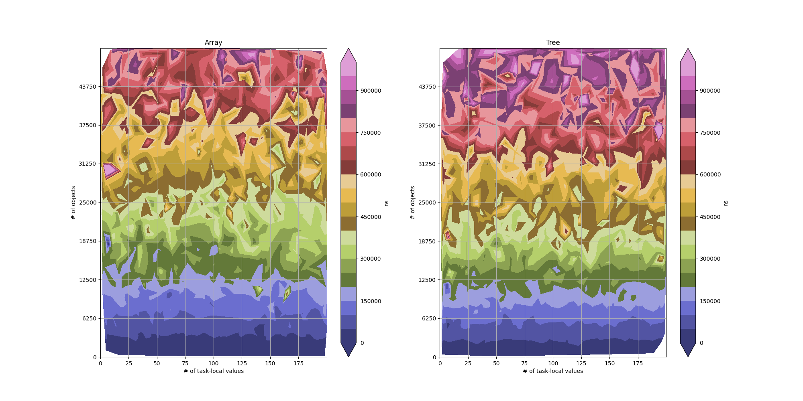
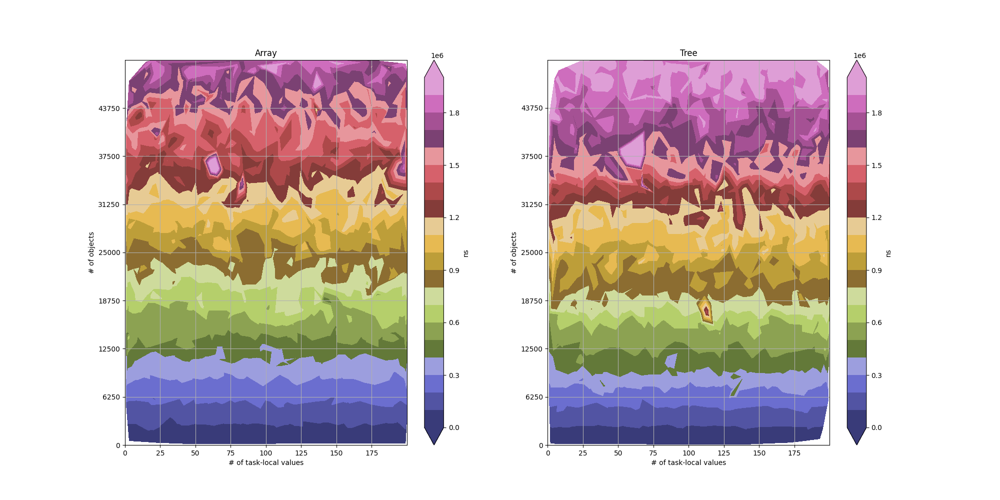
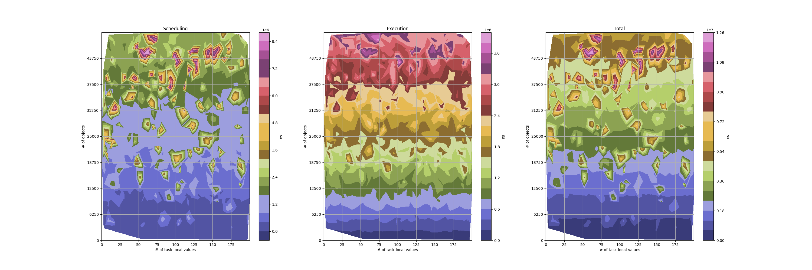
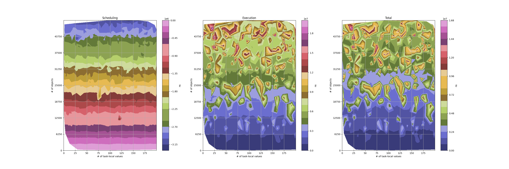
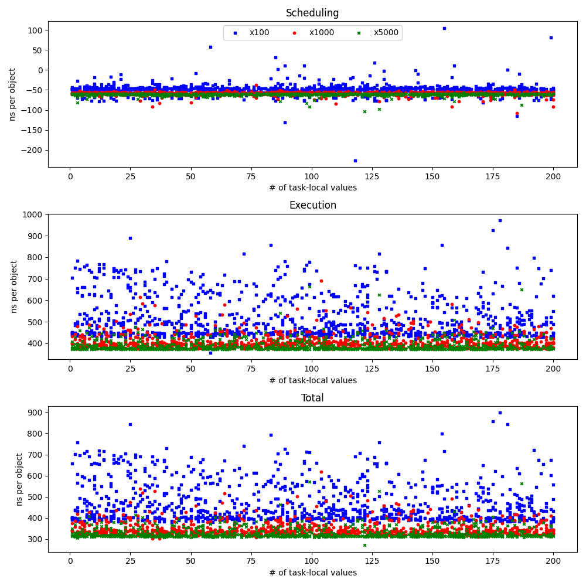
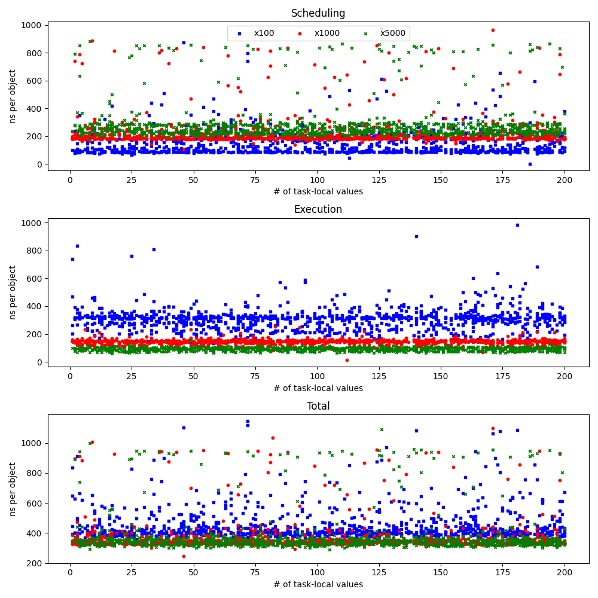
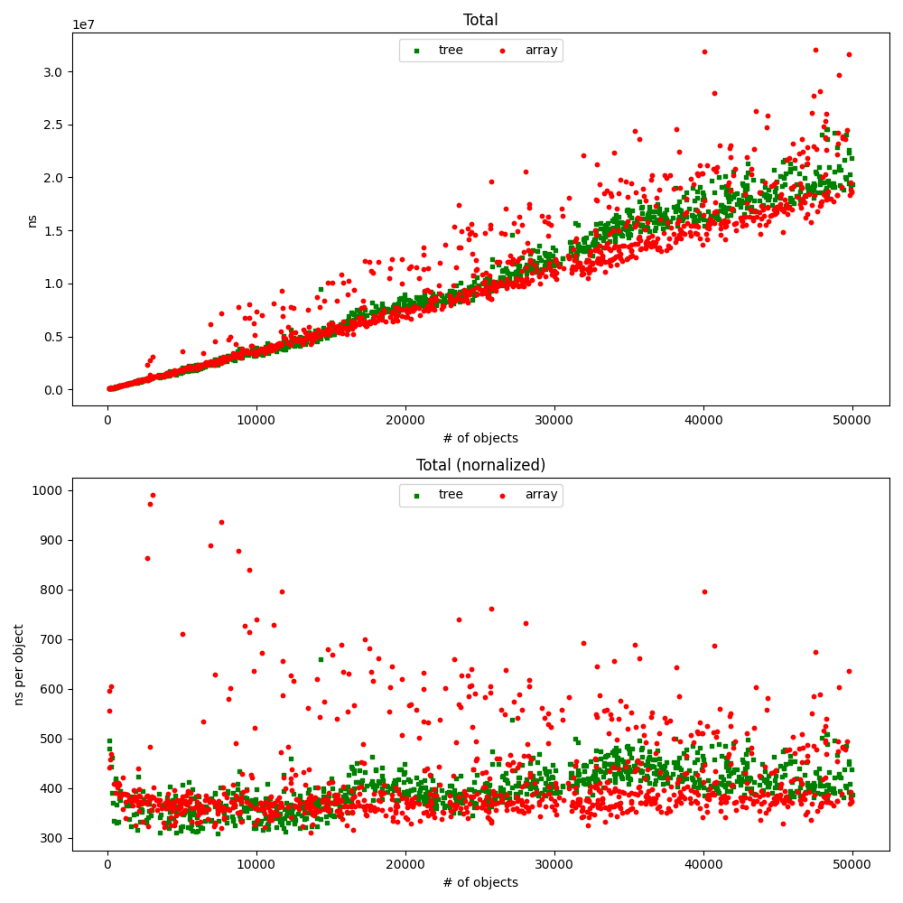
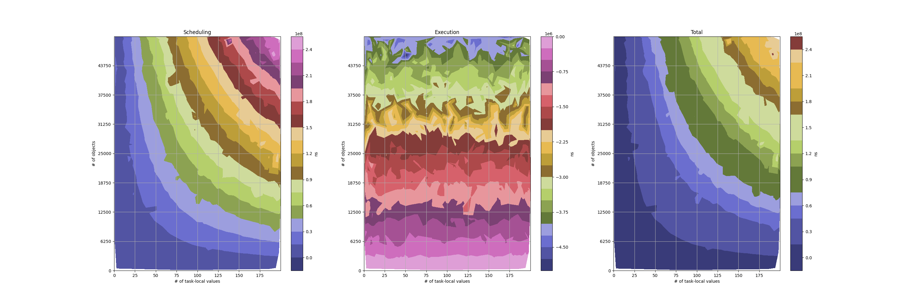
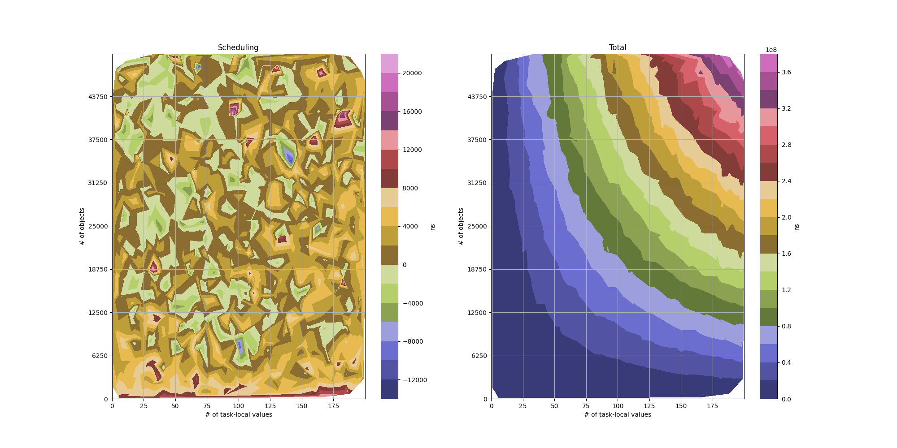

# deinit-benchmark

## Summary

Performance cost of async deinit vs regular deinit is linear (about 500-700ns per object) for small number of objects, but after certain threshold (about 2K queued objects) starts to grow quadratically. I don't have a good explanation for this.

After replacing std::set<> with llvm::DesnseSet<> in TaskLocal::copyTo(), the cost of copying task-locals values when scheduling async deinit is now 35ns per value. Before that it was `O(n*log(n))` with numbers of about 50ns/value for 10 values, and 80ns/item for 1000 values.

Fast path of the isolated deinit has additional cost of about 20ns per object when (not) copying task-local values, and 30-35ns when (not) resetting task-local values. Benchmark deallocates large tree of objects isolated on the same actor. Only the root objects hops (slow path), the rest are released already on the correct actor (fast path). In copying scenario fast path does not touch task-locals at all, so it is faster. In the resetting scenario fast path does not insert a barrier node because task-locals are already empty after the hop, but checking if task-locals are empty apparently costs additional 10-15ns.

Slow path of the isolated deinit with resetting task-local values costs about 140ns

## Experiments

### Setup

```shell
$ ./run-benchmark.sh --help
Usage: deinit-benchmark BENCHMARK_NAME [--values=MIN:MAX:(linear|logarithmic)] [--objects=MIN:MAX:(linear|logarithmic)] [--points=POINTS]
```

Benchmark driver generates specified number of data points, by choosing random number of task-local values and objects within specified ranges.
Ranges are interpreted as closed intervals. It is possible to specify `MIN`=`MAX` to pin parameter to a specific value.

To isolate incremental cost of new features, each benchmark measures a difference in time between test case and baseline case, e.g. destroying a tree of objects with isolated deinit vs destroying a tree of objects with regular deinit.

Two times are being reported:

* **Scheduling** - how long was the thread initiating destruction blocked.
* **Total** - time from initiating destruction, to the completion of the deinit body of the last object.

For benchmarks where no hopping occurs, these two times should be almost identical.

Benchmark driver outputs results to stdout, with a header recording resolved parameters and column names:

```
# isolated_no_hop_copy_tree --values=1:200:linear --objects=100:50000:linear --points=1000
#
# values objects Δschedule(ns) Δtotal(ns)
103	13917	161251	161251
8	19278	870707	869083
196	16116	514958	515042
...
```

Benchmark results then can be analyzed by a [helper script](./regression.py) that attempts to perform multi-variable linear regression:

```shell
$ ./regression.py --help
usage: regression.py [-h] [-p PARAMS] [-y PHASES] [--min-values MIN_VALUES] [--max-values MAX_VALUES] [--min-objects MIN_OBJECTS] [--max-objects MAX_OBJECTS] dataset

positional arguments:
  dataset

options:
  -h, --help            show this help message and exit
  -p PARAMS, --params PARAMS
                        Parameters for fit against. Comma-separated list of vo2,vo,v,o2,o,1
  -y PHASES, --phases PHASES
                        Values for fit against. Comma-separated list of S,E,T - Scheduling, Execution, Total
  --min-values MIN_VALUES
  --max-values MAX_VALUES
  --min-objects MIN_OBJECTS
  --max-objects MAX_OBJECTS
```

By default it attempts to fit the data against all possible parameters, and may produce overfitting models.
It is often helpful to manually limit parameters. E.g. `./regression.py dataset -p vo` will perform linear regression assuming costs are proportional to number of task-local **v**alues times number of **o**bjects.

Additionally it is possible to filter phases being analyzed. `./regression.py dataset -y T -p vo` will show only results for the **Total** phase. Phase **Execution** is not present in the dataset explicitly, but is computed as `Total - Scheduling`.

Benchmarks come in array and tree variants. Array variants allow to cleanly measure costs of scheduling, while tree variants attempt to closer mimic real-world scenarios.

In tree variants of benchmarks which involve hopping, you can often see scheduling cost as negative. That's because in the baseline case destruction of the entire tree happens on the releasing thread, and cost is linear in number of objects. While in test case, releasing thread only schedules destruction of the root object, and cost is constant in number of objects. So negative cost per object (around 62ns) is actually the cost of executing regular deinit.

### Isolated deinit

#### 1. Fast path - copy

```shell
$ ./run-benchmark.sh isolated_no_hop_copy_array --values=1:200 --objects=100:50000 --points=1000 > data/isolated_no_hop_copy_array.txt
$ ./run-benchmark.sh isolated_no_hop_copy_tree --values=1:200 --objects=100:50000 --points=1000 > data/isolated_no_hop_copy_tree.txt
```

When copying (not resetting) task-local values, performance of the fast path of the isolated deinit does not depend on number of task-local values,
and costs about 16ns per object for array case and 18ns per object for tree case.
The 2ns difference is reproducible, but its origin is not clear.



```shell
$ ./regression.py data/isolated_no_hop_copy_array.txt -y T -p o
Total: 15.597339284634334⋅o, R² = 0.9066, Adjusted R² = 0.9065
$ ./regression.py data/isolated_no_hop_copy_tree.txt -y T -p o
Total: 18.455656955023045⋅o, R² = 0.9307, Adjusted R² = 0.9307
```

#### 2. Fast path - reset

```shell
$ ./run-benchmark.sh isolated_no_hop_reset_array --values=1:200 --objects=100:50000 --points=1000 > data/isolated_no_hop_reset_array.txt
$ ./run-benchmark.sh isolated_no_hop_reset_tree --values=1:200 --objects=100:50000 --points=1000 > data/isolated_no_hop_reset_tree.txt
```

When resetting task-local values, performance of the fast path of the isolated deinit also does not depend on number of task-local values, but costs per object are higher - 36ns for array case and 41ns for tree case. The 5ns difference between cases is reproducible, but its origin is not clear.

Extra work needed to reset task-local values is about 20ns per object.



```shell
$ ./regression.py data/isolated_no_hop_reset_array.txt -y T -p o
Total: 35.786485003793004⋅o, R² = 0.9743, Adjusted R² = 0.9742
$ ./regression.py data/isolated_no_hop_reset_tree.txt -y T -p o
Total: 41.01587233652484⋅o, R² = 0.9746, Adjusted R² = 0.9746
```

#### 3. Slow path - reset

```shell
$ ./run-benchmark.sh isolated_hop_reset_array --values=1:200 --objects=100:50000 --points=1000 > data/isolated_no_hop_reset_array.txt
$ ./run-benchmark.sh isolated_hop_reset_tree --values=1:200 --objects=100:50000 --points=1000 > data/isolated_no_hop_reset_tree.txt
```

Slow path of the isolated deinit without copying task-local values costs about 140±15ns. These benchmarks are quite noisy, and different runs give slightly different values. Negative scheduling cost in the tree variant is a cost of regular deinit. While scheduling cost in the array case is the difference between scheduling isolated deinit of one object vs executing regular deinit of one object. Numbers might look similar, but that's just a coincidence.




```shell
$ ./regression.py data/isolated_hop_reset_array.txt -p o
Scheduling:   62.5140761844284⋅o, R² = 0.3945, Adjusted R² = 0.3939
Execution :  66.82597716990809⋅o, R² = 0.9581, Adjusted R² = 0.9581
Total     : 129.34005335433648⋅o, R² = 0.6737, Adjusted R² = 0.6734
$ ./regression.py data/isolated_hop_reset_tree.txt -p o
Scheduling: -62.33280375475336⋅o, R² = 0.9956, Adjusted R² = 0.9956
Execution : 204.27288984611926⋅o, R² = 0.6524, Adjusted R² = 0.6520
Total     : 141.94008609136588⋅o, R² = 0.4787, Adjusted R² = 0.4781
```

#### 4. Slow path - copy

```shell
$ ./run-benchmark.sh isolated_hop_copy_array --values=1:200 --objects=100:50000 --points=1000 > data/isolated_hop_copy_array.txt
$ ./run-benchmark.sh isolated_hop_copy_tree --values=1:200 --objects=100:50000 --points=1000 > data/isolated_hop_copy_tree.txt
```

Cost of the slow path of the isolated deinit with copying task-local values should have a component proportional to number of task-local values times number of objects and a component proportional to the number of objects. With the latter being around 140±15ns.

But attempting to fit obtained datasets against both parameters at the same time gives different results:

```shell
$ ./regression.py data/isolated_hop_copy_array.txt -y T -p vo,o
Total: 31.573328377151007⋅v⋅o + 381.57175474205997⋅o, R² = 0.9927, Adjusted R² = 0.9927
$ ./regression.py data/isolated_hop_copy_tree.txt -y T -p vo,o
Total: 28.738011225317877⋅v⋅o + 372.19754197237535⋅o, R² = 0.9901, Adjusted R² = 0.9901
```

Zooming into different slices of the data, we can see very different values of the per-object cost:

```shell
$ ./regression.py data/isolated_hop_copy_array.txt -y T -p vo,o --max-values=50
Total: 35.41231274599847⋅v⋅o + 295.4159314254909⋅o, R² = 0.9837, Adjusted R² = 0.9836
$ ./regression.py data/isolated_hop_copy_array.txt -y T -p vo,o --min-values=51 --max-values=100
Total: 30.43937937863101⋅v⋅o + 513.5787204278745⋅o, R² = 0.9890, Adjusted R² = 0.9890
$ ./regression.py data/isolated_hop_copy_array.txt -y T -p vo,o --min-values=101 --max-values=150
Total: 30.7352158273628⋅v⋅o + 354.1501128539893⋅o, R² = 0.9902, Adjusted R² = 0.9902
$ ./regression.py data/isolated_hop_copy_array.txt -y T -p vo,o --min-values=151
Total: 35.20485780959668⋅v⋅o + -200.04035254374978⋅o, R² = 0.9904, Adjusted R² = 0.9904
$ ./regression.py data/isolated_hop_copy_tree.txt -y T -p vo,o --max-values=50
Total: 33.216900687960575⋅v⋅o + 224.2335764217327⋅o, R² = 0.9588, Adjusted R² = 0.9585
$ ./regression.py data/isolated_hop_copy_tree.txt -y T -p vo,o --min-values=51 --max-values=100
Total: 30.440890643364302⋅v⋅o + 307.57812153045893⋅o, R² = 0.9793, Adjusted R² = 0.9791
$ ./regression.py data/isolated_hop_copy_tree.txt -y T -p vo,o --min-values=101 --max-values=150
Total: 30.66527564519561⋅v⋅o + 140.95025301835983⋅o, R² = 0.9839, Adjusted R² = 0.9838
$ ./regression.py data/isolated_hop_copy_tree.txt -y T -p vo,o --min-values=151
Total: 26.881033675654628⋅v⋅o + 653.9734628908678⋅o, R² = 0.9902, Adjusted R² = 0.9901
```

There should be no additional per-object cost when copying task-local values, so observed results are likely to be an indication of the overfitting.

To isolate effects of the copying task-local values, let's benchmark it using isolated deinit without copying task-values as a baseline:

```shell
$ ./run-benchmark.sh isolated_copy_array --values=1:200 --objects=100:50000 --points=1000 > data/isolated_copy_array.txt
$ ./run-benchmark.sh isolated_copy_tree --values=1:200 --objects=100:50000 --points=1000 > data/isolated_copy_array.txt
```


### Async deinit

First let's validate that performance of async deinit without copying task-local values does not depend on the number of task-local values.

Two benchmarks can be used for this:
* `async_tree` - deallocates a binary tree of given size
* `async_array` - deallocates a array of objects

We fix range of number objects to a fixed value, and let number of task-local values be selected randomly from a linear distribution.
Benchmark is repeated for 3 different values of number of objects.


```shell
$ ./run-benchmark.sh async_tree --values=1:200 --objects=100:100 --points=1000 > data/async_tree-vs-values-100.txt 
$ ./run-benchmark.sh async_tree --values=1:200 --objects=1000:1000 --points=1000 > data/async_tree-vs-values-1000.txt
$ ./run-benchmark.sh async_tree --values=1:200 --objects=5000:5000 --points=1000 > data/async_tree-vs-values-5000.txt
$ ./run-benchmark.sh async_array --values=1:200 --objects=100:100 --points=1000 > data/async_array-vs-values-100.txt 
$ ./run-benchmark.sh async_array --values=1:200 --objects=1000:1000 --points=1000 > data/async_array-vs-values-1000.txt
$ ./run-benchmark.sh async_array --values=1:200 --objects=5000:5000 --points=1000 > data/async_array-vs-values-5000.txt
```

Plotting results shows pretty much horizontal lines. For easier comparison durations are normalized per number of objects.




And attempting to perform regression against number of task-local values gives rubbish R².

```shell
$ ./regression.py data/async_tree-vs-values-100.txt -p v,1 
Scheduling: 0.14720034717678354⋅v + -4884.234931270247, R² = 0.0000, Adjusted R² = -0.0020
Execution :  -23.699491793629342⋅v + 54000.76281262156, R² = 0.0209, Adjusted R² =  0.0189
Total     :  -23.552291446452447⋅v + 49116.52788135131, R² = 0.0224, Adjusted R² =  0.0205
$ ./regression.py data/async_tree-vs-values-1000.txt -p v,1
Scheduling:  -3.753269983170878⋅v + -58393.73801655156, R² = 0.0026, Adjusted R² =  0.0006
Execution :  -7.547297728769095⋅v + 403978.00344176096, R² = 0.0002, Adjusted R² = -0.0018
Total     : -11.300567711939745⋅v + 345584.26542520936, R² = 0.0004, Adjusted R² = -0.0016
$ ./regression.py data/async_tree-vs-values-5000.txt -p v,1
Scheduling:   3.450078413374252⋅v + -307342.51929036854, R² = 0.0002, Adjusted R² = -0.0019
Execution : -0.23145246290276794⋅v + 1934989.0708021887, R² = 0.0000, Adjusted R² = -0.0020
Total     :    3.218625950471484⋅v + 1627646.5515118204, R² = 0.0000, Adjusted R² = -0.0020
$ ./regression.py data/async_array-vs-values-100.txt -p v,1
Scheduling: 2.4317184474247444⋅v + 14124.10763059641, R² = 0.0003, Adjusted R² = -0.0017
Execution : 7.186227269560555⋅v + 30009.201698502035, R² = 0.0027, Adjusted R² =  0.0007
Total     :  9.617945716985414⋅v + 44133.30932909846, R² = 0.0027, Adjusted R² =  0.0007
$ ./regression.py data/async_tree-vs-values-1000.txt -p v,1
Scheduling:  -3.753269983170878⋅v + -58393.73801655156, R² = 0.0026, Adjusted R² =  0.0006
Execution :  -7.547297728769095⋅v + 403978.00344176096, R² = 0.0002, Adjusted R² = -0.0018
Total     : -11.300567711939745⋅v + 345584.26542520936, R² = 0.0004, Adjusted R² = -0.0016
$ ./regression.py data/async_tree-vs-values-5000.txt -p v,1
Scheduling:   3.450078413374252⋅v + -307342.51929036854, R² = 0.0002, Adjusted R² = -0.0019
Execution : -0.23145246290276794⋅v + 1934989.0708021887, R² = 0.0000, Adjusted R² = -0.0020
Total     :    3.218625950471484⋅v + 1627646.5515118204, R² = 0.0000, Adjusted R² = -0.0020
```

Note that scheduling deallocation of the root of a tree is faster then deallocating entire tree, because only 1 objects needs to be scheduled. This shows that async deinit can be used to unblock thread of last release faster at the cost of slower deallocation in another task.

Now we can analyze performance of async deinit depending only on number of objects:

```shell
$ ./run-benchmark.sh async_tree --values=1:1 --objects=100:50000 --points=1000 > data/async_tree-vs-objects.txt 
$ ./run-benchmark.sh async_array --values=1:1 --objects=100:50000 --points=1000 > data/async_array-vs-objects.txt
```



```shell
$ ./regression.py data/async_tree-vs-objects.txt -p o,1
Scheduling: -62.03628799124445⋅o + 1319.8175314705481, R² = 0.9964, Adjusted R² = 0.9964
Execution :  502.1604231178307⋅o + -684561.5415930031, R² = 0.9848, Adjusted R² = 0.9848
Total     : 440.12413512658634⋅o + -683241.7240615345, R² = 0.9805, Adjusted R² = 0.9804
$ ./regression.py data/async_array-vs-objects.txt -p o,1
Scheduling:   341.9412867451418⋅o + -75775.4954550333, R² = 0.8212, Adjusted R² = 0.8209
Execution :  85.31886018727057⋅o + -94431.03322500603, R² = 0.9329, Adjusted R² = 0.9328
Total     : 427.26014693241245⋅o + -170206.5286800412, R² = 0.8768, Adjusted R² = 0.8766
```

This shows that total cost of async deinit is linear in number of objects, costing about 400ns extra per object. The `async_array` benchmark shows that most of the time is spent in scheduling task for async deinit. The `async_tree` is not indicative, because measured scheduling time includes only scheduling destruction of the root object. Scheduling destruction of the child nodes is included in the "Execution".

### Copying task-local values in async deinit

#### Array

```shell
$ ./run-benchmark.sh async_copy_array --values=1:200 --objects=100:50000 --points=1000 > data/async_copy_array.txt 
```



```shell
$ ./regression.py data/async_copy_array.txt -p vo,o  
Scheduling:   24.984413687185803⋅v⋅o + 169.55852433924048⋅o, R² = 0.9952, Adjusted R² = 0.9952
Execution : 0.003699444311821941⋅v⋅o + -80.34199529218753⋅o, R² = 0.9667, Adjusted R² = 0.9666
Total     :    24.988113131497613⋅v⋅o + 89.21652904705317⋅o, R² = 0.9951, Adjusted R² = 0.9951
./regression.py data/async_copy_array.txt -y S,T -p vo                                                                                
Scheduling: 26.264204261611525⋅v⋅o, R² = 0.9933, Adjusted R² = 0.9933
Total     : 25.661499936450927⋅v⋅o, R² = 0.9946, Adjusted R² = 0.9946
```

When scheduling async deinit, it costs about 25ns to copy a task-local value. Data is too noisy to determine if there is a per-object cost independent of number of task-local values.

Surprisingly there seems to be linear dependency between execution time and number of objects. Each extra object **decreases** execution time by 80ns. That's a very surprising effect, for which I don't have an explanation yet.

#### Tree

```shell
$ ./run-benchmark.sh async_copy_tree --values=1:200 --objects=100:50000 --points=1000 > data/async_copy_tree.txt 
```



Difference in scheduling is too noisy to draw any conclusions about effect of copying task-locals on scheduling of the destruction of the root of the tree:

```shell
$ ./regression.py data/async_copy_tree.txt -y S        
Scheduling: -1.7290801314669238e-08⋅v⋅o² + 0.001235787251508909⋅v⋅o + -7.618884224050876⋅v + 5.302224585147051e-06⋅o² + -0.3656720714361409⋅o + 5570.464743812955, R² = 0.1265, Adjusted R² = 0.1212
```

But differences in total execution time allow to conclude that copying task-locals in async deinit costs about 40ns per value per object:

```shell
$ ./regression.py data/async_copy_tree.txt -y T -p vo
Total: 39.14231151032403⋅v⋅o, R² = 0.9981, Adjusted R² = 0.9981
```

It is not clear what causes 15ns difference between array and tree cases.